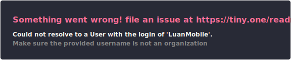

## Olá! Sou o Luan Henrique 👋

Sou Engenheiro de Software com foco em desenvolvimento back-end utilizando PHP e Laravel. Trabalho na construção de APIs, integrações e aplicações escaláveis, sempre buscando escrever código limpo, de fácil manutenção e com foco em performance.

- 💻 **Engenheiro de Software** | Graduado em **Análise e Desenvolvimento de Sistemas**
- ⚙️ Experiência com **PHP (Laravel)**, **Vue.js**, **Node.js**, **MySQL**, **PostgreSQL** e **Docker**
- 🚀 Interesse em **Arquitetura de Software**, **APIs**, **Integrações**, **Filas** e **Performance**

## 📊 GitHub Stats

  
   
  

## 💻 Tecnologias e Ferramentas

  
  
  
  
  
  
  
  
  

## 📬 Contato

Entre em contato comigo:

